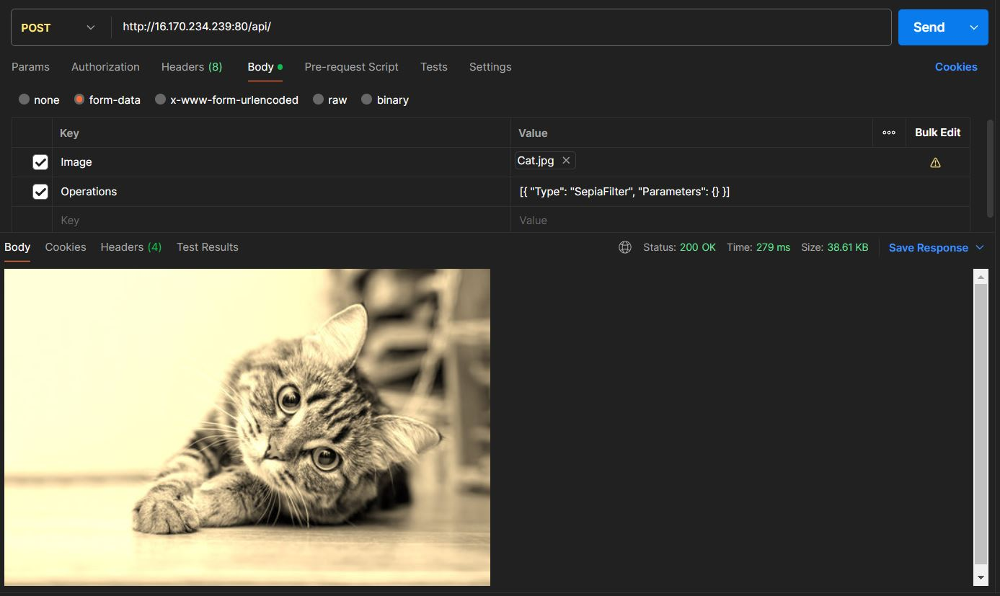

## API Usage

**Endpoint:** `POST 16.170.234.239:80/api/`
**Content-Type:** `multipart/form-data`

### Request Structure

| Field | Type | Description |
|-------|------|-------------|
| `Image` | File | Image file to be processed. |
| `Operations` | String | JSON array of operations to be applied. |

```C#
public class ProcessingRequestDto
{
    public IFormFile Image { get; set; }
    public string Operations { get; set; }
}
```

Operations - JSON example:
```
[
    {
        "Type": "GrayscaleFilter",
        "Parameters": {}
    },
    {
        "Type": "MirrorTransform",
        "Parameters": {}
    }
]

```

### Supported Operations

| Operation | Parameters | Description |
|-----------|------------|-------------|
| `GrayscaleFilter` | None | Monochrome effect. |
| `InvertFilter` | None | Photographic negative. |
| `SepiaFilter` | None | Sepia tone effect. |
| `SharpenFilter` | None | Sharpen tone effect. |


### Examples Request

Requests can be done using `curl` or Postman.



### Response

Returns processed image as binary JPEG data with `Content-Type: image/jpeg`.