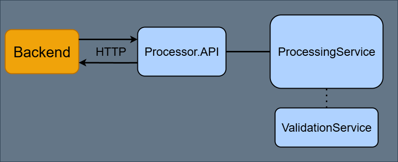

### WORK IN PROGRESS



Example, JSON Request:

```
{
  "fileName": "InputImage.jpg",
  "operations": [
    {
      "type": "Transform",
      "name": "Resize",
      "parameters": {
        "width": "800",
        "height": "600"
      }
    },
    {
      "type": "Filter",
      "name": "Grayscale",
      "parameters": {}
    }
  ],
  "imageBase64": "/9j/4AAQ..."
}
```

Example, JSON Response:
```
{
  "response": true,
  "message": "No errors.",
  "fileName": "OutputImage.jpg",
  "imageBase64": "/9j/4AAQ..."
}
```